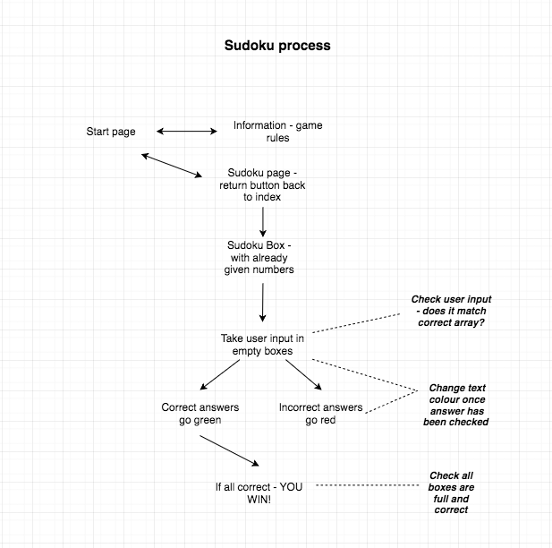
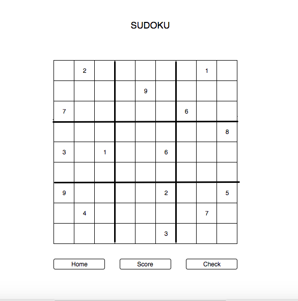

# Sudoku_Game

## Sudoku ##
---

  Sudoku is a mathematical based game. It requires the user inputting numbers within empty boxes; ensuring each box, row and column correspond. The image above shows the layout and design of the game.
  
 ## Purpose of the game ##
---

The purpose of this game is to test your mathematical and problem solving skills. It requires you to identify present numbers and find any patterns, if this can't be done it requires you to figure out where numbers fit through trial and error. The more this game is played the higher the chance of you figuring it out quicker, strengthening your skills.

## Getting started ##
---

In order for this game to be run you need ALL the files and a web browser. Within the Sudoku_Game folder are sub folders and files:
+ Sudoku.html
+ Index.html
+ JS folder
  + app.js
+ CSS folder
  + style.css
+ Sound folder
  + Win.mp3
  + Fail.mp3

Once you have the Sudoku_Game folder, all you need to do is open the Index.html file in your browser.

## Instructions ##
---

  In order to play Sudoku you need to understand the basics of what the game requires.
  You must place the numbers 1-9 within each box. However, the boxes directly adjacent must not contain numbers in the same rows or columns as the others.
  A small example of how the boxes should look is given below:
  
  <table>
  <tr>
   <td>
    1 2 3
   </td>
   <td>
     4 5 6
   </td>
  </tr>
  <tr>
   <td>
     4 5 6 
   </td>
   <td>
      7 8 9
   </td>
  </tr>
  <tr>
   <td>
      7 8 9 
   </td>
   <td>
     1 2 3
   </td>
  </tr>
 </table>
  
  As you can see, the numbers on the left go from 1-9 without any of the numbers being the same; this is also found on the right hand side, so both columns are correct.
  
  This also works if you go across the rows, each number is present but is not found more than once on that row.
  
  This is how Sudoku works, you need to be able to place numbers within the empty boxes, without finding the same number within the adjacent row or column.
  
 

## Features ##
---

This game of Sudoku contains different features in order for it to perform with high functionality and providing the user with aspects that make it as realistic to the paper based puzzle as possible. This puzzle contains two main pages, the introduction page and the game itself.

The introduction page contains instructions on how the game is to be played, allowing users who have not previously played Sudoku to understand the basics of how this game is played. Once the user has read and understood the rules they then enter the game by selecting the start button.

The game page itself provides the user with the 9 x 9 Sudoku grid. Once they have access to the game they are required to fill in the empty boxes with numbers 1-9. Once they have complete all of the boxes the user can then press submit to check their answers. The programme then checks the users input to the saved solution to see if they have chosen the correct input.
The user is provided with an alert that tells them if they have won or not once they have filled in all the boxes and clicked submit. 

After the submit button has provided the user with their win/lose alert a sound plays, that corresponds with the message presented to the user. If the player doesn't complete the Sudoku correctly they will be told something is incorrect, which prompts them to try again until they find their error - then presenting the win alert.

## Implementation ##
---
This game was created with the use of HTML, CSS, JavaScript and JQuery. In order for this game to be created the layout, difficulty level and information processes needed to be decided and planned out. Below are two images, one is a flowchart that covers the processes the game will undertake and the effects they will have on the results. The other is an initial sketch of how the game would look, which helped with development of the page and grid as there was a basic idea of how it should look and lay on the page prior to creation.

##### Flowchart #####

##### Sketch #####

### Issues ###
---
Whilst creating this project there were different issues that arose throughout that slowed down the development time at stages as they needed to be fixed. The games pages, grid layout and CSS styling were done initially and set out the layout for the rest of the coding. After this was complete the JavaScript needed to be created to be able to collect the user input and check it to the correct answers of the table and to provide them with a message on completion.

The Main issue throughout this project was creating JavaScript that would take the users input from the input field within the grid. The first time attempting this allowed me to collect user input but didn't show what the value they had input was. Instead of collecting user input per box and checking them individually, it was found that it would work if all of the users input were collected and checked against the correct answers for all of the missing squares at the same time. This was the biggest issue through the project as multiple options were tried and tested but all of them failed until this option worked.

Another issue was to find a way to make the correct answers go green and the incorrect ones to go red. Each way this was tried it was either changing the colour of the button text, rather than the text on button click; whilst also changing the colour of the text before being checked - making all the text green.

  #### How they were overcome ####

To overcome the issue of not taking in user input, there were functions and loops implemented into the code to collect all of the users input at the end of the game, check them against a correct array and then output a message for correct/incorrect guesses. This way the user is able to see if they have won without running into issues along the way. 
  
### Future Additions ###
---

There are other features that would have been added if there were more time, or less time was spent fixing the initial error. The extra features that would have been added, include: 

+ Green/Red colour changes
+ Multiple levels - ranging in difficulty
+ Timer - how long does it take to complete?
+ Save the users score each time they get it correct

These features would be added to the game to enhance the interacitivity and personalisation each game would have. They would enhance the level of what it provides the user and how much interactivity they are able to gain from it.
